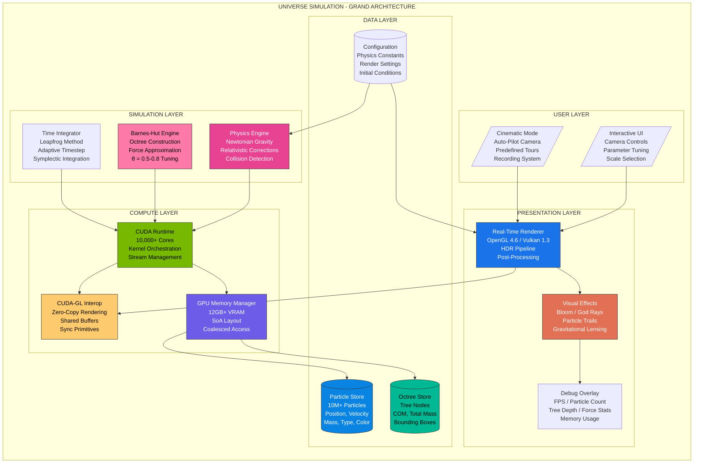

# Universe Simulation

A high-performance real-time universe / galaxy simulation built with **C++**, **CUDA**, **OpenGL**, and **Barnes-Hut N-body acceleration**.

This branch (``main``) is the **performance-oriented profile**, tuned to push GPU workload harder and explore larger particle counts on modern NVIDIA GPUs.

---
## Architecture Diagram



## Features

- Real-time **N-body gravitational simulation**
- **Barnes-Hut** accelerated force calculation
- CUDA-based particle compute pipeline
- OpenGL particle rendering
- Interactive camera controls
- Runtime toggles for:
  - Bloom
  - Trails
  - Stellar evolution
  - Overlay
- Multiple simulation presets:
  - Big Bang
  - Galaxy Collision
  - Protogalactic Cloud
  - Solar System
- Screenshot and recording hooks
- Performance overlay with:
  - FPS
  - frame time
  - force / tree / integration timings
  - live particle stats

---

## Branch Profiles

This repository uses multiple branches for different goals:

### ``main``
**Performance branch**
- tuned for higher particle counts
- pushes GPU utilization harder
- intended for stress testing / benchmarking / larger simulations

### `fps`
**High-FPS branch**
- tuned for smoother real-time interaction
- lower rendering / simulation overhead
- better for stable demos and experimentation

---

## Tech Stack

- **C++17**
- **CUDA**
- **OpenGL 4.6**
- **GLFW**
- **GLAD**
- **GLM**
- **CMake**
- **Ninja** (recommended on Windows)

---

## Current Status

This is an actively evolving simulation engine.

The ``main`` branch prioritizes:
- higher GPU workload
- larger particle counts
- aggressive performance-oriented settings

It is ideal if you want to explore:
- heavier simulations
- GPU stress profiles
- bigger-scale system behavior

---

## Build Requirements

### Hardware
- NVIDIA GPU with CUDA support
- Recommended: **RTX 4060 Laptop GPU or better**
- 8 GB VRAM minimum recommended for heavier configs

### Software
- Windows
- Visual Studio Build Tools / MSVC
- CUDA Toolkit
- CMake
- Ninja

---

## Build Instructions (Windows)

Use **x64 Native Tools Command Prompt for VS**.

### 1. Go to build folder
```bat
cd C:\Users\user\Desktop\universe-sim
mkdir build
cd build
```
### 2.Configure
```bat
cmake -G "Ninja" -DCMAKE_BUILD_TYPE=Release -DCMAKE_MAKE_PROGRAM="%CD%\ninja.exe" ..
```
### 3.Build
```bat
ninja.exe
```
### 4.Run
```bat
universe-sim.exe
```
## Controls
### Camera
* **W A S D** &rarr; : move
* **Q / E** &rarr;: vertical move
* **Mouse Right Button + Move** &rarr;: rotate camera
* **Mouse Wheel** &rarr;: zoom
### Simulation
* **SPACE** &rarr;: pause / resume
* **TAB** &rarr;: cycle camera mode
### Runtime Toggles
* **B** &rarr;: bloom
* **T** &rarr;: trails
* **V** &rarr;: stellar evolution
* **G** &rarr;: volumetric toggle hook
* **F4** &rarr;: overlay
### Output
* **F2** &rarr;: screenshot
* **F3** &rarr;: recording toggle
### Scenario Switching
* **1** &rarr;: Big Bang
* **2** &rarr;: Galaxy Collision
* **3** &rarr;: Protogalactic Cloud
* **4** &rarr;: Solar System
## Performance Philosophy of `main`
This branch is designed to push the GPU harder instead of maximizing absolute FPS.

That means:

* larger particle counts
* more frequent updates
* higher rendering workload
* more aggressive simulation settings
If your goal is the smoothest possible interactive experience, use the `fps` branch.

If your goal is higher load / bigger scenes / stronger GPU utilization, use `main`.
## Runtime settings live in:
```text
config/simulation.json
```
Key parameters include:
* particle_count
* theta
* softening_length
* timestep
* bloom_enabled
* trails_enabled
* window_width
* window_height

### Example Performance-Oriented Config
```JSON
{
  "particle_count": 100000,
  "theta": 1.10,
  "bloom_enabled": true,
  "trails_enabled": true,
  "window_width": 2560,
  "window_height": 1440
}
```
## Notes
* CUDA/OpenGL interop can be sensitive on dual-GPU laptops.
* For best results, force the application to use the NVIDIA GPU in Windows Graphics Settings.
* If CUDA 13.x causes compiler instability on your machine, consider trying CUDA 12.8 for improved Windows toolchain stability.

## Design
### Why GPU-first?
The dominant cost in large particle systems is force evaluation.
A GPU-first architecture allows:

* high arithmetic throughput,
* batched force evaluation,
* real-time parameter iteration,
* tight integration with rendering.
### Why Barnes-Hut?
Brute force quickly becomes intractable as particle count increases.
Barnes-Hut provides a practical balance between:

* physical plausibility,
* scalability,
* implementation complexity,
* interactive frame rate.
### Why separate branches?
Performance tuning is highly workload-dependent.
The same architecture can be tuned either for:

* maximum throughput, or
* maximum responsiveness.
* Maintaining separate branch profiles makes the experimental intent explicit.

## Limitations
Current limitations include:

* simplified physics relative to full astrophysical solvers
* approximate diagnostics
* branch-dependent tuning rather than full automatic workload adaptation
* Windows/CUDA toolchain sensitivity depending on compiler/CUDA version
* no distributed or multi-GPU support
* no validated scientific output guarantees
This is best viewed as an interactive GPU simulation framework rather than a finished research code.

## Future Work
### Planned directions include:

* more robust Barnes-Hut traversal optimization
improved particle coloring and radiative appearance
* more stable CUDA toolchain abstraction
better scenario/state serialization
stronger profiling support
* branch-specific tuning presets
* cleaner separation between scientific and visual modes
### Longer term:

* SPH / gas dynamics experiments
* multi-resolution render paths
* higher-order diagnostics
* hybrid CPU/GPU fallback orchestration
* multi-GPU or out-of-core experiments