# Universe Simulation

A high-performance real-time universe / galaxy simulation built with **C++**, **CUDA**, **OpenGL**, and **Barnes-Hut N-body acceleration**.

This branch (``main``) is the **performance-oriented profile**, tuned to push GPU workload harder and explore larger particle counts on modern NVIDIA GPUs.

---
## Architecture Diagram


### 1A. Particle Type Hierarchy
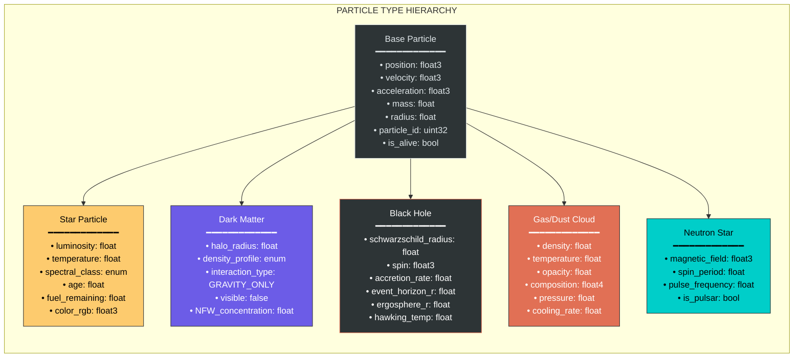
### 1B. GPU Memory Layout — Structure of Arrays (SoA)
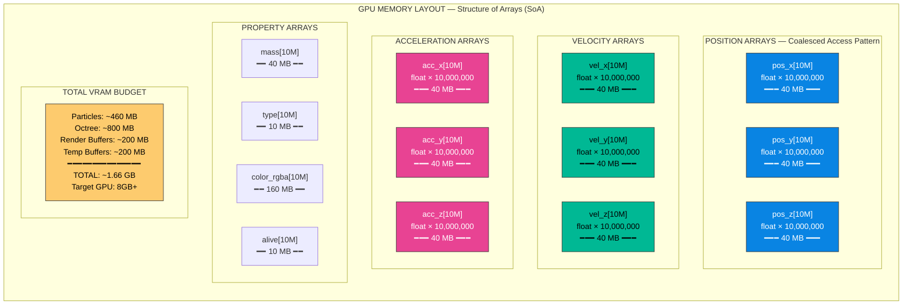
### 1C. Initial Conditions Generator
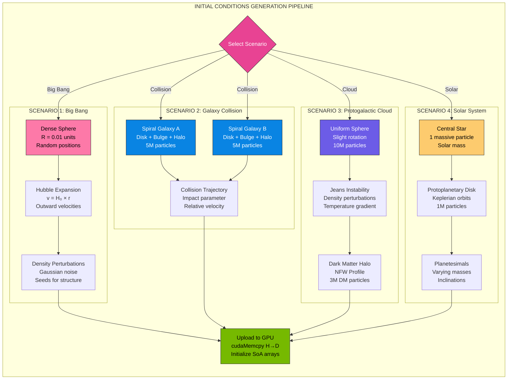
### 2A. Octree Node Structure
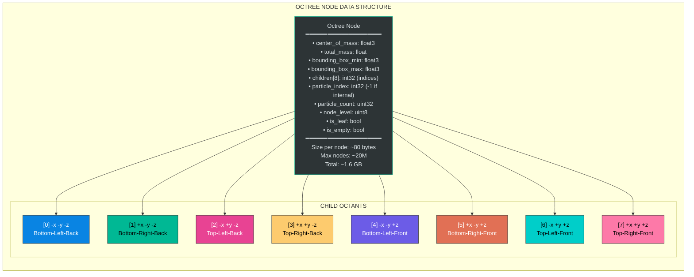
### 2B. GPU Octree Construction Pipeline
```mermaid

graph TB
    subgraph "️ GPU OCTREE CONSTRUCTION — Per Frame"
        direction TB
        
        STEP1["STEP 1: Compute Bounding Box<br/>━━━━━━━━━━━━━━━━━━━━<br/>Parallel reduction over all particles<br/>Find min/max x, y, z<br/>Kernel: computeBoundingBox<<<blocks, 256>>><br/>Output: Root node bounds"]
        
        STEP2["STEP 2: Assign Morton Codes<br/>━━━━━━━━━━━━━━━━━━━━<br/>For each particle: compute 64-bit Morton code<br/>Interleave x, y, z bits<br/>Space-filling curve mapping<br/>Kernel: assignMortonCodes<<<blocks, 256>>>"]
        
        STEP3["STEP 3: Radix Sort by Morton Code<br/>━━━━━━━━━━━━━━━━━━━━<br/>GPU parallel radix sort (CUB library)<br/>Sort particles by spatial locality<br/>Result: Z-order curve ordering<br/>Enables coalesced tree construction"]
        
        STEP4["STEP 4: Build Tree Hierarchy<br/>━━━━━━━━━━━━━━━━━━━━<br/>Detect common prefixes in Morton codes<br/>Parallel Karras (2012) algorithm<br/>Each internal node: 1 CUDA thread<br/>Kernel: buildRadixTree<<<blocks, 256>>>"]
        
        STEP5["STEP 5: Calculate Node Properties<br/>━━━━━━━━━━━━━━━━━━━━<br/>Bottom-up traversal using atomics<br/>Accumulate: total mass, center of mass<br/>Compute: bounding box sizes<br/>Kernel: computeNodeProps<<<blocks, 256>>>"]
        
        STEP6["STEP 6: Tree Ready for Force Calc<br/>━━━━━━━━━━━━━━━━━━━━<br/>~20M nodes for 10M particles<br/>Rebuild every frame (~5ms on RTX 4090)<br/>Alternatively: incremental update"]
        
        STEP1 --> STEP2 --> STEP3 --> STEP4 --> STEP5 --> STEP6
    end
    
    style STEP1 fill:#e84393,stroke:#333,color:#fff
    style STEP2 fill:#6c5ce7,stroke:#333,color:#fff
    style STEP3 fill:#0984e3,stroke:#333,color:#fff
    style STEP4 fill:#00b894,stroke:#333,color:#000
    style STEP5 fill:#fdcb6e,stroke:#333,color:#000
    style STEP6 fill:#76b900,stroke:#333,color:#000
```
### 2C. Barnes-Hut Force Calculation — θ Criterion
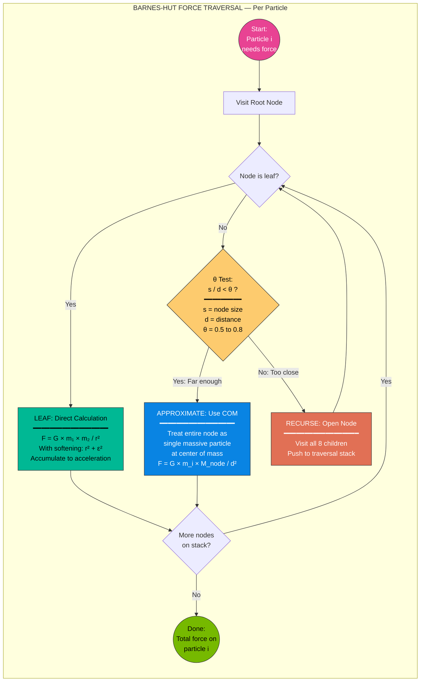
### 2D. Complexity Comparison
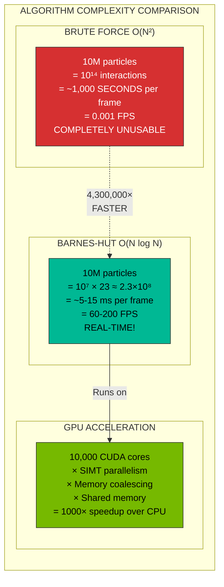

### 3A. Kernel Execution Order — Per Frame
```mermaid

graph TB
    subgraph "CUDA KERNEL EXECUTION — SINGLE FRAME TIMELINE"
        direction TB
        
        subgraph "STREAM 0: Physics Compute"
            K1[" Kernel 1: computeBoundingBox<br/>Grid: 1024 blocks × 256 threads<br/>Parallel min/max reduction<br/>Input: positions[10M]<br/>Output: bbox_min, bbox_max<br/>Time: ~0.3 ms"]
            
            K2[" Kernel 2: assignMortonCodes<br/>Grid: 40000 blocks × 256 threads<br/>1 thread per particle<br/>Input: positions + bbox<br/>Output: morton_codes[10M]<br/>Time: ~0.5 ms"]
            
            K3[" Kernel 3: radixSort<br/>CUB DeviceRadixSort<br/>64-bit keys, 32-bit values<br/>Input: morton_codes<br/>Output: sorted_indices<br/>Time: ~2.0 ms"]
            
            K4[" Kernel 4: buildRadixTree<br/>Grid: 40000 blocks × 256 threads<br/>Karras algorithm<br/>Input: sorted morton codes<br/>Output: tree hierarchy<br/>Time: ~1.5 ms"]
            
            K5[" Kernel 5: computeNodeProperties<br/>Grid: 80000 blocks × 256 threads<br/>Bottom-up with atomics<br/>Input: tree + particles<br/>Output: COM, total_mass per node<br/>Time: ~1.0 ms"]
            
            K6[" Kernel 6: computeForces<br/>Grid: 40000 blocks × 256 threads<br/>Tree traversal per particle<br/>Input: tree + particles<br/>Output: accelerations[10M]<br/>Time: ~5.0 ms BOTTLENECK"]
            
            K7[" Kernel 7: integrateLeapfrog<br/>Grid: 40000 blocks × 256 threads<br/>Kick-Drift-Kick scheme<br/>Input: pos, vel, acc, dt<br/>Output: new pos, vel<br/>Time: ~0.5 ms"]
            
            K8[" Kernel 8: handleCollisions<br/>Grid: 40000 blocks × 256 threads<br/>Merge close particles<br/>Black hole absorption<br/>Time: ~0.8 ms"]
        end
        
        subgraph "STREAM 1: Render Prep (Overlapped)"
            R1[" Kernel R1: computeColors<br/>Temperature → RGB mapping<br/>Velocity → brightness<br/>Time: ~0.3 ms"]
            
            R2[" Kernel R2: updateRenderBuffer<br/>Write to GL interop buffer<br/>LOD culling for camera<br/>Time: ~0.2 ms"]
        end
        
        K1 --> K2 --> K3 --> K4 --> K5 --> K6 --> K7 --> K8
        K6 --> R1 --> R2
        
        SYNC[" cudaDeviceSynchronize<br/>Frame Complete<br/>━━━━━━━━━━━━<br/>Total: ~12 ms<br/>= 83 FPS"]
        
        K8 --> SYNC
        R2 --> SYNC
    end
    
    style K1 fill:#0984e3,stroke:#333,color:#fff
    style K2 fill:#0984e3,stroke:#333,color:#fff
    style K3 fill:#6c5ce7,stroke:#333,color:#fff
    style K4 fill:#0984e3,stroke:#333,color:#fff
    style K5 fill:#0984e3,stroke:#333,color:#fff
    style K6 fill:#d63031,stroke:#333,color:#fff
    style K7 fill:#00b894,stroke:#333,color:#000
    style K8 fill:#e17055,stroke:#333,color:#fff
    style R1 fill:#fdcb6e,stroke:#333,color:#000
    style R2 fill:#fdcb6e,stroke:#333,color:#000
    style SYNC fill:#76b900,stroke:#333,color:#000
```
### 3B. CUDA Thread/Block Architecture
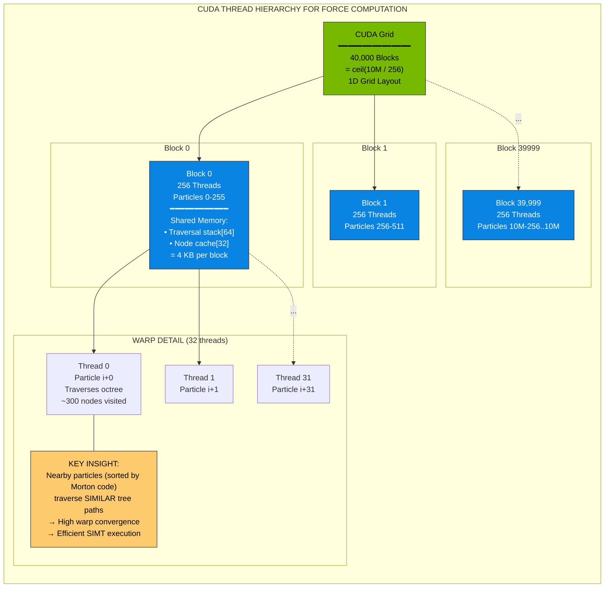
### 3C. Multi-Stream Execution Timeline
```mermaid

gantt
    title 🟩 CUDA Multi-Stream Frame Timeline (Target: 16ms = 60 FPS)
    dateFormat X
    axisFormat %L ms
    
    section Stream 0 - Physics
    Bounding Box        :s0k1, 0, 300
    Morton Codes        :s0k2, after s0k1, 500
    Radix Sort          :s0k3, after s0k2, 2000
    Build Tree          :s0k4, after s0k3, 1500
    Node Properties     :s0k5, after s0k4, 1000
    Force Calculation   :crit, s0k6, after s0k5, 5000
    Integration         :s0k7, after s0k6, 500
    Collisions          :s0k8, after s0k7, 800
    
    section Stream 1 - Render Prep
    Compute Colors      :s1k1, after s0k6, 300
    Update GL Buffer    :s1k2, after s1k1, 200
    
    section Stream 2 - Async Copy
    Stats to Host       :s2k1, after s0k8, 100
    Diagnostics         :s2k2, after s2k1, 100
    
    section OpenGL
    Draw Call           :gl1, after s1k2, 2000
    Post-Processing     :gl2, after gl1, 1000
    SwapBuffers         :gl3, after gl2, 200
```
### 4A. Gravitational Physics Pipeline
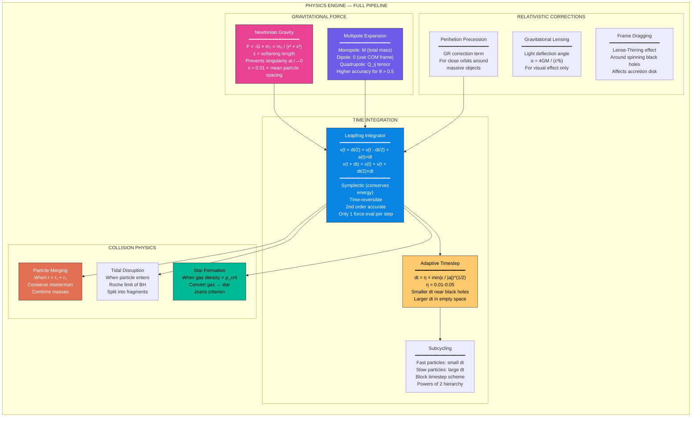
### 4B. Force Computation Detail Flow
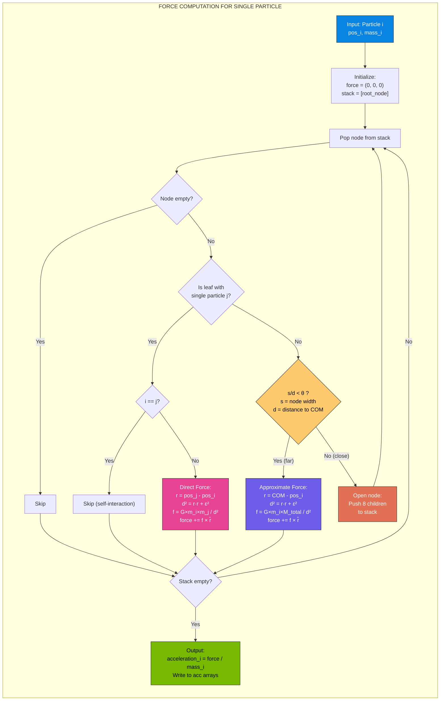
### 5A. CUDA-OpenGL Interop Architecture
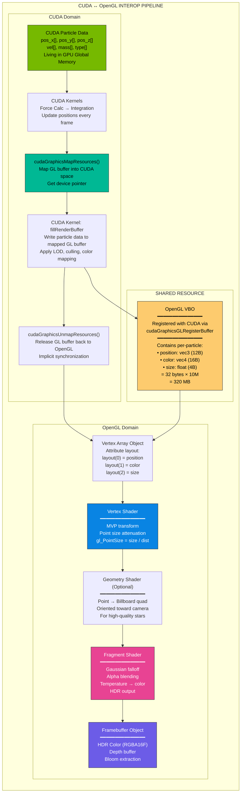
### 5B. Full Render Pipeline
```mermaid

graph TB
    subgraph " COMPLETE RENDERING PIPELINE"
        direction TB
        
        subgraph "PASS 1: PARTICLE RENDER"
            P1_1["Bind Particle VAO"]
            P1_2["Set GL States:<br/>glEnable(GL_BLEND)<br/>glBlendFunc(ONE, ONE)<br/>Additive blending"]
            P1_3["glDrawArrays(GL_POINTS, 0, N)<br/>10M draw calls batched<br/>→ HDR FBO"]
            P1_1 --> P1_2 --> P1_3
        end
        
        subgraph "PASS 2: BLOOM EXTRACTION"
            P2_1["Read HDR Color"]
            P2_2["Threshold: Keep pixels > 1.0<br/>Bright stars, hot gas"]
            P2_3["Write to Bloom FBO"]
            P2_1 --> P2_2 --> P2_3
        end
        
        subgraph "PASS 3: GAUSSIAN BLUR"
            P3_1["Horizontal Blur<br/>13-tap Gaussian<br/>Ping-pong between FBOs"]
            P3_2["Vertical Blur<br/>13-tap Gaussian<br/>Multiple iterations (3-5)"]
            P3_3["Multi-resolution:<br/>1/2, 1/4, 1/8 resolution<br/>Wide + narrow bloom"]
            P3_1 --> P3_2 --> P3_3
        end
        
        subgraph "PASS 4: COMPOSITE"
            P4_1["Combine:<br/>Original HDR + Bloom layers"]
            P4_2["Tone Mapping:<br/>ACES Filmic or Reinhard<br/>HDR → LDR"]
            P4_3["Gamma Correction:<br/>pow(color, 1/2.2)"]
            P4_1 --> P4_2 --> P4_3
        end
        
        subgraph "PASS 5: OVERLAYS"
            P5_1["Debug Info: FPS, particles"]
            P5_2["Scale indicator"]
            P5_3["UI elements"]
            P5_1 --> P5_2 --> P5_3
        end
        
        SWAP["SwapBuffers()<br/>Present to screen<br/>VSync / Adaptive"]
        
        P1_3 --> P2_1
        P2_3 --> P3_1
        P3_3 --> P4_1
        P4_3 --> P5_1
        P5_3 --> SWAP
    end
    
    style P1_3 fill:#0984e3,stroke:#333,color:#fff
    style P2_2 fill:#fdcb6e,stroke:#333,color:#000
    style P3_2 fill:#e84393,stroke:#333,color:#fff
    style P4_2 fill:#6c5ce7,stroke:#333,color:#fff
    style SWAP fill:#76b900,stroke:#333,color:#000
```
### 5C. Alternative Vulkan Pipeline
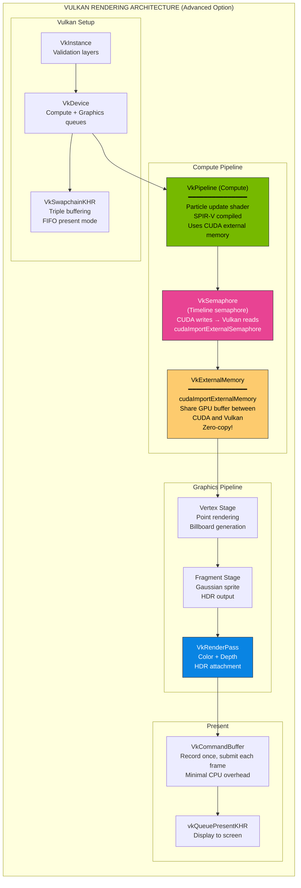
### 6A. Scale Hierarchy
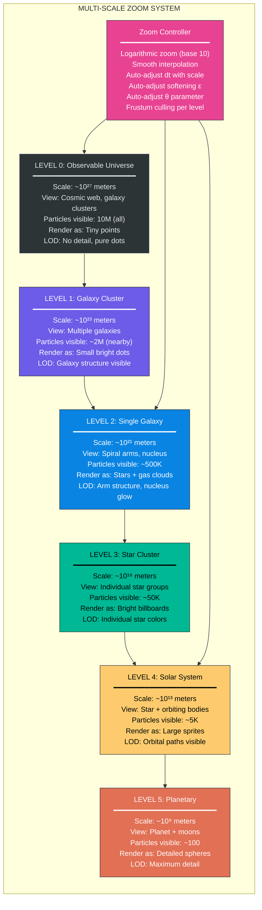
### 6B. LOD (Level of Detail) System
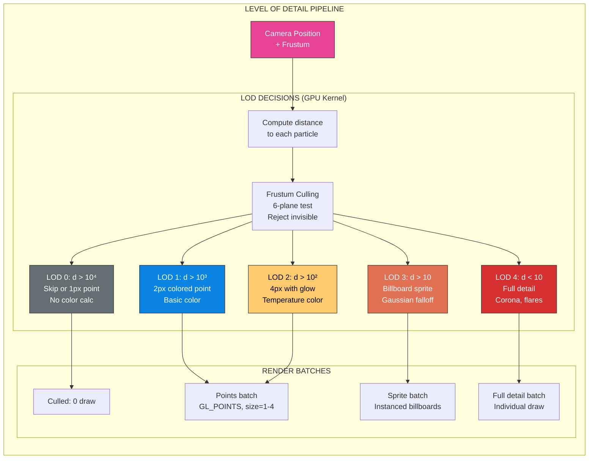
### 7A. Black Hole Architecture
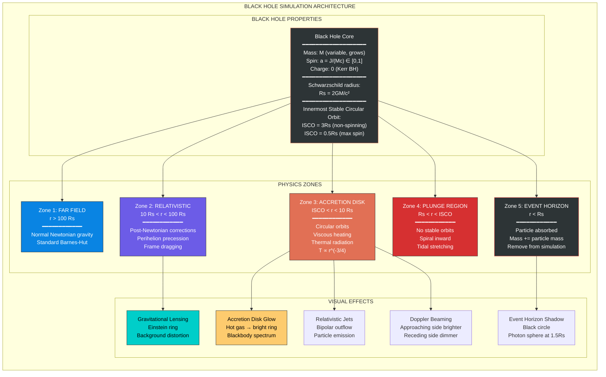
### 7B. Dark Matter Halo Model
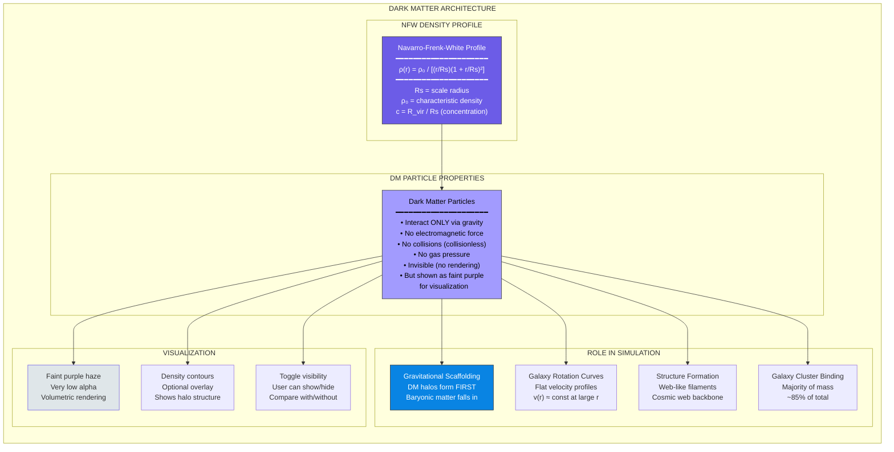
### 7C. Stellar Evolution State Machine
```mermaid

stateDiagram-v2
    [*] --> GasCloud: Initial condition
    
    GasCloud --> Protostar: Jeans collapse\nρ > ρ_critical
    
    Protostar --> MainSequence: T_core > 10⁷ K\nHydrogen fusion begins
    
    MainSequence --> RedGiant: Hydrogen exhausted\nCore contracts
    
    state "Main Sequence" as MainSequence {
        [*] --> OType: M > 16 M\nBlue, T>30000K
        [*] --> BType: 2-16 M\nBlue-white
        [*] --> GType: 0.8-1.04 M\nYellow (Sun-like)
        [*] --> MType: 0.08-0.45 M\nRed dwarf
    }
    
    RedGiant --> PlanetaryNebula: M < 8 M\nOuter layers ejected
    RedGiant --> Supernova: M > 8 M\nCore collapse
    
    PlanetaryNebula --> WhiteDwarf: Core remains\nNo fusion
    
    Supernova --> NeutronStar: 1.4 < M/M < 3\nDegeneracy pressure
    Supernova --> BlackHole: M > 3 M\nNothing stops collapse
    
    WhiteDwarf --> [*]: Cooling forever
    NeutronStar --> [*]: Pulsar spindown
    BlackHole --> [*]: Hawking radiation\n(cosmological time)
    
    note right of GasCloud
        Color: Red/Orange
        Low luminosity
        High opacity
    end note
    
    note right of MainSequence
        Color varies by type
        Stable for millions-billions of years
        Most of stellar lifetime
    end note
    
    note right of Supernova
        VISUAL: Massive bright flash
        Particle explosion effect
        Spawn debris particles
    end note
    
    note right of BlackHole
        VISUAL: Dark sphere
        Accretion disk
        Gravitational lensing
    end note
```
### 8A. GPU Memory Map
```mermaid

graph TB
    subgraph " GPU VRAM ALLOCATION MAP (Target: RTX 4090 — 24 GB)"
        direction TB
        
        subgraph "PARTICLE DATA — 460 MB"
            MEM1["Position Arrays (x,y,z)<br/>3 × 40 MB = 120 MB"]
            MEM2["Velocity Arrays (x,y,z)<br/>3 × 40 MB = 120 MB"]
            MEM3["Acceleration Arrays (x,y,z)<br/>3 × 40 MB = 120 MB"]
            MEM4["Properties (mass, type, alive, age)<br/>~100 MB"]
        end
        
        subgraph "OCTREE DATA — 800 MB"
            MEM5["Tree Nodes (~20M nodes)<br/>80 bytes × 20M = 1.6 GB<br/>Optimized: 40 bytes × 20M = 800 MB"]
            MEM6["Morton Codes<br/>8 bytes × 10M = 80 MB"]
            MEM7["Sorted Indices<br/>4 bytes × 10M = 40 MB"]
        end
        
        subgraph "RENDER BUFFERS — 400 MB"
            MEM8["GL Interop VBO<br/>32 bytes × 10M = 320 MB"]
            MEM9["Framebuffers (HDR, Bloom)<br/>~80 MB @ 4K"]
        end
        
        subgraph "TEMPORARY — 200 MB"
            MEM10["Sort workspace<br/>Reduction buffers<br/>Atomic counters"]
        end
        
        subgraph " TOTAL"
            MEMTOTAL["━━━━━━━━━━━━━━━━━━━<br/>Particles: 460 MB<br/>Octree: 920 MB<br/>Render: 400 MB<br/>Temp: 200 MB<br/>━━━━━━━━━━━━━━━━━━━<br/>TOTAL: ~2.0 GB<br/>━━━━━━━━━━━━━━━━━━━<br/>Fits in RTX 3060 (12 GB) <br/>Fits in RTX 4090 (24 GB) <br/>Room for 50M particles<br/>on high-end GPU"]
        end
    end
    
    style MEM1 fill:#0984e3,stroke:#333,color:#fff
    style MEM5 fill:#00b894,stroke:#333,color:#000
    style MEM8 fill:#fdcb6e,stroke:#333,color:#000
    style MEM10 fill:#636e72,stroke:#333,color:#fff
    style MEMTOTAL fill:#76b900,stroke:#333,color:#000
```
### 8B. Performance Optimization Strategies
```mermaid

graph TB
    subgraph " PERFORMANCE OPTIMIZATION HIERARCHY"
        direction TB
        
        subgraph "MEMORY OPTIMIZATIONS"
            OPT1["SoA over AoS<br/>━━━━━━━━━━━━━<br/>Structure of Arrays<br/>Coalesced memory access<br/>4-8× bandwidth improvement"]
            
            OPT2["Memory Coalescing<br/>━━━━━━━━━━━━━<br/>Consecutive threads access<br/>consecutive memory<br/>128-byte cache lines"]
            
            OPT3["Shared Memory Caching<br/>━━━━━━━━━━━━━<br/>Cache tree nodes in SMEM<br/>48 KB per SM<br/>Reduces global memory reads"]
            
            OPT4["Texture Memory<br/>━━━━━━━━━━━━━<br/>Tree nodes in texture cache<br/>2D spatial locality<br/>Read-only optimization"]
        end
        
        subgraph "COMPUTE OPTIMIZATIONS"
            OPT5["Warp-Level Primitives<br/>━━━━━━━━━━━━━<br/>__shfl_sync for reductions<br/>__ballot_sync for decisions<br/>Avoid shared memory atomics"]
            
            OPT6["Morton Code Sorting<br/>━━━━━━━━━━━━━<br/>Particles sorted spatially<br/>Nearby particles → same warp<br/>Similar tree traversal paths"]
            
            OPT7["Occupancy Tuning<br/>━━━━━━━━━━━━━<br/>256 threads per block<br/>Register usage < 32<br/>Target: 75%+ occupancy"]
            
            OPT8["Multi-Stream Overlap<br/>━━━━━━━━━━━━━<br/>Physics + Render prep<br/>Compute + Memory copy<br/>Pipeline parallelism"]
        end
        
        subgraph "ALGORITHMIC OPTIMIZATIONS"
            OPT9["Adaptive θ<br/>━━━━━━━━━━━━━<br/>θ = 0.8 (fast, less accurate)<br/>θ = 0.3 (slow, more accurate)<br/>Dynamic based on FPS target"]
            
            OPT10["Tree Caching<br/>━━━━━━━━━━━━━<br/>Don't rebuild tree every frame<br/>Rebuild every 2-4 frames<br/>Incremental updates"]
            
            OPT11["Particle Grouping<br/>━━━━━━━━━━━━━<br/>Group nearby particles<br/>Share force computation<br/>Evaluate group-node interaction"]
        end
        
        subgraph " PERFORMANCE TARGETS"
            PERF["━━━━━ TARGET METRICS ━━━━━<br/>10M particles: 30-60 FPS<br/>1M particles: 120+ FPS<br/>Force calc: < 10 ms<br/>Tree build: < 5 ms<br/>Render: < 3 ms<br/>Total frame: < 16 ms"]
        end
    end
    
    style OPT1 fill:#0984e3,stroke:#333,color:#fff
    style OPT5 fill:#76b900,stroke:#333,color:#000
    style OPT9 fill:#e84393,stroke:#333,color:#fff
    style PERF fill:#fdcb6e,stroke:#333,color:#000
```
### 9A. Camera System Architecture
```mermaid

graph TB
    subgraph " CAMERA & INTERACTION SYSTEM"
        direction TB
        
        subgraph "CAMERA MODES"
            FREE[" Free Camera<br/>━━━━━━━━━━━━━<br/>WASD + Mouse<br/>No constraints<br/>Explore freely"]
            
            ORBIT[" Orbit Camera<br/>━━━━━━━━━━━━━<br/>Locked to target particle<br/>Rotate around it<br/>Scroll to zoom"]
            
            FOLLOW[" Follow Camera<br/>━━━━━━━━━━━━━<br/>Track specific particle<br/>Smooth interpolation<br/>Watch its journey"]
            
            CINEMATIC[" Cinematic Camera<br/>━━━━━━━━━━━━━<br/>Predefined path splines<br/>Catmull-Rom interpolation<br/>Auto-zoom, auto-pan"]
            
            OVERVIEW[" Overview Camera<br/>━━━━━━━━━━━━━<br/>See entire simulation<br/>Auto-frame all particles<br/>God-mode view"]
        end
        
        subgraph "CAMERA PROPERTIES"
            PROPS["Camera State<br/>━━━━━━━━━━━━━<br/>position: float3<br/>target: float3<br/>up: float3<br/>fov: float (10°-170°)<br/>near_plane: adaptive<br/>far_plane: adaptive<br/>zoom_level: log scale<br/>speed: scale-dependent"]
        end
        
        subgraph "INTERACTION"
            MOUSE["Mouse Controls<br/>Left: Rotate<br/>Right: Pan<br/>Scroll: Zoom (log)<br/>Click: Select particle"]
            
            KEYBOARD["Keyboard Controls<br/>WASD: Move<br/>QE: Roll<br/>Space: Pause<br/>Tab: Switch mode<br/>1-5: Preset views<br/>R: Reset<br/>F: Follow nearest"]
            
            TOUCH["Touch Controls (Future)<br/>Pinch: Zoom<br/>Drag: Rotate<br/>Double-tap: Select"]
        end
        
        subgraph "SMART FEATURES"
            AUTO_SCALE["Auto-Scale Speed<br/>Move faster when zoomed out<br/>Move slower when zoomed in<br/>speed = base × log(distance)"]
            
            SMOOTH["Smoothing<br/>Exponential damping<br/>60 FPS interpolation<br/>No jerky motion"]
            
            FOCUS["Auto-Focus Interesting<br/>Find densest region<br/>Find fastest collision<br/>Find nearest black hole"]
        end
        
        FREE --> PROPS
        ORBIT --> PROPS
        FOLLOW --> PROPS
        CINEMATIC --> PROPS
        OVERVIEW --> PROPS
        
        MOUSE --> PROPS
        KEYBOARD --> PROPS
        
        PROPS --> AUTO_SCALE
        PROPS --> SMOOTH
        PROPS --> FOCUS
    end
    
    style FREE fill:#0984e3,stroke:#333,color:#fff
    style ORBIT fill:#00b894,stroke:#333,color:#000
    style FOLLOW fill:#e84393,stroke:#333,color:#fff
    style CINEMATIC fill:#fdcb6e,stroke:#333,color:#000
    style OVERVIEW fill:#6c5ce7,stroke:#333,color:#fff
    style PROPS fill:#2d3436,stroke:#dfe6e9,color:#dfe6e9
```
### 9B. Cinematic Tour Sequence
```mermaid

graph LR
    subgraph " CINEMATIC TOUR — AUTO CAMERA PATH"
        direction LR
        
        SHOT1["Shot 1: THE BIRTH<br/>━━━━━━━━━━━━━<br/>Duration: 10s<br/>Start: Close to center<br/>All particles compressed<br/>Slowly pull back<br/>Watch expansion begin"]
        
        SHOT2["Shot 2: STRUCTURE FORMS<br/>━━━━━━━━━━━━━<br/>Duration: 15s<br/>Wide shot<br/>Time acceleration 100×<br/>Filaments appear<br/>Cosmic web emerges"]
        
        SHOT3["Shot 3: GALAXY BIRTH<br/>━━━━━━━━━━━━━<br/>Duration: 12s<br/>Zoom into densest node<br/>Spiral structure forming<br/>Orbit around galaxy"]
        
        SHOT4["Shot 4: COLLISION<br/>━━━━━━━━━━━━━<br/>Duration: 15s<br/>Find 2 nearby galaxies<br/>Watch approach<br/>Tidal tails stretch<br/>Merger happens"]
        
        SHOT5["Shot 5: BLACK HOLE<br/>━━━━━━━━━━━━━<br/>Duration: 10s<br/>Zoom to heaviest object<br/>See accretion disk<br/>Orbit event horizon"]
        
        SHOT6["Shot 6: PULL BACK<br/>━━━━━━━━━━━━━<br/>Duration: 20s<br/>Smoothly zoom out<br/>Solar → Galaxy → Cluster<br/>→ Universe scale<br/>Final wide shot"]
        
        SHOT1 --> SHOT2 --> SHOT3 --> SHOT4 --> SHOT5 --> SHOT6
    end
    
    style SHOT1 fill:#2d3436,stroke:#fdcb6e,color:#fff
    style SHOT2 fill:#6c5ce7,stroke:#333,color:#fff
    style SHOT3 fill:#0984e3,stroke:#333,color:#fff
    style SHOT4 fill:#d63031,stroke:#333,color:#fff
    style SHOT5 fill:#2d3436,stroke:#e17055,color:#fff
    style SHOT6 fill:#00b894,stroke:#333,color:#000

```
### 10A. Post-Processing Chain
```mermaid

graph TB
    subgraph " POST-PROCESSING EFFECTS PIPELINE"
        direction TB
        
        RAW["Raw HDR Render<br/>Particles as points<br/>Linear color space<br/>RGBA16F format"]
        
        subgraph "BLOOM"
            BLOOM1["Brightness Extract<br/>Threshold > 1.0"]
            BLOOM2["Downsample Chain<br/>Full → 1/2 → 1/4 → 1/8 → 1/16"]
            BLOOM3["Gaussian Blur<br/>Each mip level<br/>H + V separable"]
            BLOOM4["Upsample + Combine<br/>Additive blending<br/>Wide ethereal glow"]
        end
        
        subgraph "GRAVITATIONAL LENSING"
            LENS1["Identify Black Holes<br/>Screen-space positions"]
            LENS2["Distortion Map<br/>UV offset texture<br/>Based on mass + distance"]
            LENS3["Apply Distortion<br/>Sample background<br/>with warped UVs"]
            LENS4["Einstein Ring<br/>Bright ring artifact<br/>at Schwarzschild radius"]
        end
        
        subgraph "PARTICLE TRAILS"
            TRAIL1["History Buffer<br/>Store last N positions<br/>Ring buffer on GPU"]
            TRAIL2["Trail Geometry<br/>Line strip per particle<br/>Fading alpha over time"]
            TRAIL3["Trail Rendering<br/>Additive blend<br/>Shows orbital paths"]
        end
        
        subgraph "VOLUMETRIC EFFECTS"
            VOL1["Gas Density Field<br/>3D texture from gas particles<br/>Scatter to grid"]
            VOL2["Ray Marching<br/>Screen-space rays<br/>Sample density field"]
            VOL3["Nebula Rendering<br/>Emission + absorption<br/>Beautiful color gradients"]
        end
        
        subgraph "FINAL COMPOSITE"
            TONE["Tone Mapping<br/>ACES Filmic"]
            GAMMA["Gamma Correction<br/>sRGB output"]
            VIGNETTE["Vignette<br/>Darkened edges<br/>Cinematic feel"]
            CHROM["Chromatic Aberration<br/>Subtle RGB split<br/>Lens effect"]
        end
        
        RAW --> BLOOM1 --> BLOOM2 --> BLOOM3 --> BLOOM4
        RAW --> LENS1 --> LENS2 --> LENS3 --> LENS4
        RAW --> TRAIL1 --> TRAIL2 --> TRAIL3
        RAW --> VOL1 --> VOL2 --> VOL3
        
        BLOOM4 --> TONE
        LENS4 --> TONE
        TRAIL3 --> TONE
        VOL3 --> TONE
        TONE --> GAMMA --> VIGNETTE --> CHROM
        
        OUTPUT["️ Final Frame<br/>Present to screen"]
        CHROM --> OUTPUT
    end
    
    style RAW fill:#636e72,stroke:#333,color:#fff
    style BLOOM4 fill:#fdcb6e,stroke:#333,color:#000
    style LENS3 fill:#6c5ce7,stroke:#333,color:#fff
    style TRAIL3 fill:#e84393,stroke:#333,color:#fff
    style VOL3 fill:#e17055,stroke:#333,color:#fff
    style TONE fill:#0984e3,stroke:#333,color:#fff
    style OUTPUT fill:#76b900,stroke:#333,color:#000
```
### 10B. Color Mapping System
```mermaid

graph TB
    subgraph " PARTICLE COLOR MAPPING"
        direction TB
        
        subgraph "STAR COLORING — Blackbody Spectrum"
            TEMP["Surface Temperature (K)"]
            
            T1["T < 3,500 K<br/>M-dwarf<br/> Deep Red<br/>RGB: (255, 80, 40)"]
            T2["3,500-5,000 K<br/>K-type<br/> Orange<br/>RGB: (255, 180, 80)"]
            T3["5,000-6,000 K<br/>G-type (Sun)<br/> Yellow<br/>RGB: (255, 255, 150)"]
            T4["6,000-7,500 K<br/>F-type<br/> White<br/>RGB: (255, 255, 255)"]
            T5["7,500-10,000 K<br/>A-type<br/> Light Blue<br/>RGB: (180, 200, 255)"]
            T6["10,000-30,000 K<br/>B-type<br/> Blue<br/>RGB: (100, 140, 255)"]
            T7["T > 30,000 K<br/>O-type<br/> Deep Blue<br/>RGB: (80, 80, 255)"]
            
            TEMP --> T1
            TEMP --> T2
            TEMP --> T3
            TEMP --> T4
            TEMP --> T5
            TEMP --> T6
            TEMP --> T7
        end
        
        subgraph "SPECIAL COLORINGS"
            DM_COLOR["Dark Matter<br/> Purple, very low alpha<br/>RGBA: (150, 80, 255, 0.05)"]
            GAS_COLOR["Gas Clouds<br/> Red-orange, variable alpha<br/>Based on temperature + density"]
            BH_COLOR["Black Hole<br/> Black center<br/> Golden accretion disk<br/>Doppler shift: blue/red sides"]
            JET_COLOR["Relativistic Jet<br/> Bright blue-white<br/>High velocity particles"]
        end
    end
    
    style T1 fill:#d63031,stroke:#333,color:#fff
    style T2 fill:#e17055,stroke:#333,color:#fff
    style T3 fill:#fdcb6e,stroke:#333,color:#000
    style T4 fill:#dfe6e9,stroke:#333,color:#333
    style T5 fill:#74b9ff,stroke:#333,color:#000
    style T6 fill:#0984e3,stroke:#333,color:#fff
    style T7 fill:#6c5ce7,stroke:#333,color:#fff
    style DM_COLOR fill:#a29bfe,stroke:#333,color:#000
    style BH_COLOR fill:#2d3436,stroke:#fdcb6e,color:#fff
```
### 11A. Content Pipeline
```mermaid

graph TB
    subgraph " CONTENT CREATION PIPELINE"
        direction TB
        
        subgraph "CAPTURE"
            CAP1["GPU Frame Capture<br/>glReadPixels or PBO<br/>4K resolution (3840×2160)<br/>60 FPS"]
            CAP2["CPU Encode Queue<br/>Async PBO readback<br/>Double/triple buffer<br/>No frame drops"]
            CAP3["FFmpeg Encoding<br/>H.265/HEVC<br/>High bitrate: 50 Mbps<br/>Or lossless for editing"]
        end
        
        subgraph "RECORDING MODES"
            MODE1[" Cinematic Mode<br/>Predefined camera paths<br/>60 FPS locked<br/>Slow-mo capable"]
            MODE2[" Screenshot Mode<br/>8K super-sampling<br/>PNG lossless<br/>Portfolio images"]
            MODE3[" Timelapse Mode<br/>Record every Nth frame<br/>1 second = 1000 timesteps<br/>Watch evolution"]
            MODE4[" Focus Mode<br/>Track specific region<br/>Galaxy formation<br/>BH accretion"]
        end
        
        subgraph "POST-PRODUCTION"
            POST1["Video Editing<br/>Add music<br/>Add text overlays<br/>Trim sequences"]
            POST2["Thumbnail Generation<br/>Most photogenic frame<br/>High contrast<br/>Galaxy spiral shot"]
            POST3["GIF Creation<br/>Short loops<br/>Galaxy rotation<br/>Collision sequence"]
        end
        
        subgraph "DISTRIBUTION"
            LINKEDIN["LinkedIn Post<br/>━━━━━━━━━━━━━<br/>Hook text<br/>60s video<br/>Technical description<br/>GitHub link"]
            YOUTUBE["YouTube Video<br/>━━━━━━━━━━━━━<br/>5-10 min explainer<br/>Technical deep-dive<br/>Full cinematic"]
            TWITTER["Twitter/X Thread<br/>━━━━━━━━━━━━━<br/>GIF preview<br/>Thread explaining<br/>physics + code"]
            GITHUB["GitHub Repo<br/>━━━━━━━━━━━━━<br/>Full source code<br/>Build instructions<br/>Demo videos<br/>Architecture docs"]
        end
        
        CAP1 --> CAP2 --> CAP3
        MODE1 --> CAP1
        MODE2 --> CAP1
        MODE3 --> CAP1
        MODE4 --> CAP1
        CAP3 --> POST1 --> POST2 --> POST3
        POST1 --> LINKEDIN
        POST1 --> YOUTUBE
        POST3 --> TWITTER
        POST1 --> GITHUB
    end
    
    style CAP1 fill:#0984e3,stroke:#333,color:#fff
    style MODE1 fill:#e84393,stroke:#333,color:#fff
    style LINKEDIN fill:#0077b5,stroke:#333,color:#fff
    style YOUTUBE fill:#d63031,stroke:#333,color:#fff
    style TWITTER fill:#2d3436,stroke:#333,color:#fff
    style GITHUB fill:#2d3436,stroke:#dfe6e9,color:#dfe6e9
```
### 12A. Complete Frame Loop
```mermaid

graph TB
    subgraph " COMPLETE FRAME LOOP — END TO END"
        direction TB
        
        FRAME_START(("FRAME<br/>START<br/>t = N"))
        
        INPUT[" Process Input<br/>Mouse, Keyboard<br/>Update camera<br/>Check toggles<br/> 0.1 ms"]
        
        subgraph "GPU COMPUTE PHASE"
            BBOX["1. Bounding Box<br/>Parallel reduction<br/> 0.3 ms"]
            MORTON["2. Morton Codes<br/>Spatial hashing<br/> 0.5 ms"]
            SORT["3. Radix Sort<br/>CUB library<br/> 2.0 ms"]
            TREE["4. Build Tree<br/>Karras algorithm<br/> 1.5 ms"]
            PROPS["5. Node Properties<br/>Bottom-up accumulate<br/> 1.0 ms"]
            FORCES["6. Force Calculation<br/>Tree traversal<br/> 5.0 ms "]
            INTEGRATE["7. Integration<br/>Leapfrog step<br/> 0.5 ms"]
            COLLIDE["8. Collisions<br/>Merge/absorb<br/> 0.8 ms"]
            EVOLVE["9. Stellar Evolution<br/>Age, type transitions<br/> 0.3 ms"]
        end
        
        subgraph " INTEROP PHASE"
            MAP["cudaGraphicsMap<br/> 0.05 ms"]
            FILL["Fill render buffer<br/>Color mapping, LOD<br/> 0.5 ms"]
            UNMAP["cudaGraphicsUnmap<br/> 0.05 ms"]
        end
        
        subgraph "RENDER PHASE"
            CLEAR["Clear framebuffers"]
            DRAW_PARTICLES["Draw particles<br/>10M GL_POINTS<br/> 1.5 ms"]
            DRAW_TRAILS["Draw trails<br/>Line strips<br/> 0.5 ms"]
            DRAW_BH["Draw BH effects<br/>Lensing shader<br/> 0.3 ms"]
            POST_BLOOM["Post: Bloom<br/> 0.5 ms"]
            POST_TONE["Post: Tone map<br/> 0.1 ms"]
            POST_UI["Draw UI overlay<br/> 0.2 ms"]
        end
        
        PRESENT["SwapBuffers<br/>Present to display<br/> VSync"]
        
        FRAME_END(("FRAME<br/>END<br/>t = N+1"))
        
        STATS["Frame Stats:<br/>Total: ~15 ms<br/>= 66 FPS<br/>GPU Util: 95%"]
        
        FRAME_START --> INPUT --> BBOX
        BBOX --> MORTON --> SORT --> TREE --> PROPS --> FORCES --> INTEGRATE --> COLLIDE --> EVOLVE
        EVOLVE --> MAP --> FILL --> UNMAP
        UNMAP --> CLEAR --> DRAW_PARTICLES --> DRAW_TRAILS --> DRAW_BH
        DRAW_BH --> POST_BLOOM --> POST_TONE --> POST_UI --> PRESENT --> FRAME_END
        
        FRAME_END -->|"Next frame"| FRAME_START
        PRESENT --> STATS
    end
    
    style FRAME_START fill:#00b894,stroke:#333,color:#000
    style FRAME_END fill:#d63031,stroke:#333,color:#fff
    style FORCES fill:#d63031,stroke:#fdcb6e,color:#fff
    style DRAW_PARTICLES fill:#0984e3,stroke:#333,color:#fff
    style POST_BLOOM fill:#fdcb6e,stroke:#333,color:#000
    style STATS fill:#76b900,stroke:#333,color:#000
    style FILL fill:#6c5ce7,stroke:#333,color:#fff
```
## Features

- Real-time **N-body gravitational simulation**
- **Barnes-Hut** accelerated force calculation
- CUDA-based particle compute pipeline
- OpenGL particle rendering
- Interactive camera controls
- Runtime toggles for:
  - Bloom
  - Trails
  - Stellar evolution
  - Overlay
- Multiple simulation presets:
  - Big Bang
  - Galaxy Collision
  - Protogalactic Cloud
  - Solar System
- Screenshot and recording hooks
- Performance overlay with:
  - FPS
  - frame time
  - force / tree / integration timings
  - live particle stats

---

## Branch Profiles

This repository uses multiple branches for different goals:

### ``main``
**Performance branch**
- tuned for higher particle counts
- pushes GPU utilization harder
- intended for stress testing / benchmarking / larger simulations

### `fps`
**High-FPS branch**
- tuned for smoother real-time interaction
- lower rendering / simulation overhead
- better for stable demos and experimentation

---

## Tech Stack

- **C++17**
- **CUDA**
- **OpenGL 4.6**
- **GLFW**
- **GLAD**
- **GLM**
- **CMake**
- **Ninja** (recommended on Windows)

---

## Current Status

This is an actively evolving simulation engine.

The ``main`` branch prioritizes:
- higher GPU workload
- larger particle counts
- aggressive performance-oriented settings

It is ideal if you want to explore:
- heavier simulations
- GPU stress profiles
- bigger-scale system behavior

---

## Build Requirements

### Hardware
- NVIDIA GPU with CUDA support
- Recommended: **RTX 4060 Laptop GPU or better**
- 8 GB VRAM minimum recommended for heavier configs

### Software
- Windows
- Visual Studio Build Tools / MSVC
- CUDA Toolkit
- CMake
- Ninja

---

## Build Instructions (Windows)

Use **x64 Native Tools Command Prompt for VS**.

### 1. Go to build folder
```bat
cd C:\Users\user\Desktop\universe-sim
mkdir build
cd build
```
### 2.Configure
```bat
cmake -G "Ninja" -DCMAKE_BUILD_TYPE=Release -DCMAKE_MAKE_PROGRAM="%CD%\ninja.exe" ..
```
### 3.Build
```bat
ninja.exe
```
### 4.Run
```bat
universe-sim.exe
```
## Controls
### Camera
* **W A S D** &rarr; : move
* **Q / E** &rarr;: vertical move
* **Mouse Right Button + Move** &rarr;: rotate camera
* **Mouse Wheel** &rarr;: zoom
### Simulation
* **SPACE** &rarr;: pause / resume
* **TAB** &rarr;: cycle camera mode
### Runtime Toggles
* **B** &rarr;: bloom
* **T** &rarr;: trails
* **V** &rarr;: stellar evolution
* **G** &rarr;: volumetric toggle hook
* **F4** &rarr;: overlay
### Output
* **F2** &rarr;: screenshot
* **F3** &rarr;: recording toggle
### Scenario Switching
* **1** &rarr;: Big Bang
* **2** &rarr;: Galaxy Collision
* **3** &rarr;: Protogalactic Cloud
* **4** &rarr;: Solar System
## Performance Philosophy of `main`
This branch is designed to push the GPU harder instead of maximizing absolute FPS.

That means:

* larger particle counts
* more frequent updates
* higher rendering workload
* more aggressive simulation settings
If your goal is the smoothest possible interactive experience, use the `fps` branch.

If your goal is higher load / bigger scenes / stronger GPU utilization, use `main`.
## Runtime settings live in:
```text
config/simulation.json
```
Key parameters include:
* particle_count
* theta
* softening_length
* timestep
* bloom_enabled
* trails_enabled
* window_width
* window_height

### Example Performance-Oriented Config
```JSON
{
  "particle_count": 100000,
  "theta": 1.10,
  "bloom_enabled": true,
  "trails_enabled": true,
  "window_width": 2560,
  "window_height": 1440
}
```
## Notes
* CUDA/OpenGL interop can be sensitive on dual-GPU laptops.
* For best results, force the application to use the NVIDIA GPU in Windows Graphics Settings.
* If CUDA 13.x causes compiler instability on your machine, consider trying CUDA 12.8 for improved Windows toolchain stability.

## Design
### Why GPU-first?
The dominant cost in large particle systems is force evaluation.
A GPU-first architecture allows:

* high arithmetic throughput,
* batched force evaluation,
* real-time parameter iteration,
* tight integration with rendering.
### Why Barnes-Hut?
Brute force quickly becomes intractable as particle count increases.
Barnes-Hut provides a practical balance between:

* physical plausibility,
* scalability,
* implementation complexity,
* interactive frame rate.
### Why separate branches?
Performance tuning is highly workload-dependent.
The same architecture can be tuned either for:

* maximum throughput, or
* maximum responsiveness.
* Maintaining separate branch profiles makes the experimental intent explicit.

## Limitations
Current limitations include:

* simplified physics relative to full astrophysical solvers
* approximate diagnostics
* branch-dependent tuning rather than full automatic workload adaptation
* Windows/CUDA toolchain sensitivity depending on compiler/CUDA version
* no distributed or multi-GPU support
* no validated scientific output guarantees
This is best viewed as an interactive GPU simulation framework rather than a finished research code.

## Future Work
### Planned directions include:

* more robust Barnes-Hut traversal optimization
improved particle coloring and radiative appearance
* more stable CUDA toolchain abstraction
better scenario/state serialization
stronger profiling support
* branch-specific tuning presets
* cleaner separation between scientific and visual modes
### Longer term:

* SPH / gas dynamics experiments
* multi-resolution render paths
* higher-order diagnostics
* hybrid CPU/GPU fallback orchestration
* multi-GPU or out-of-core experiments